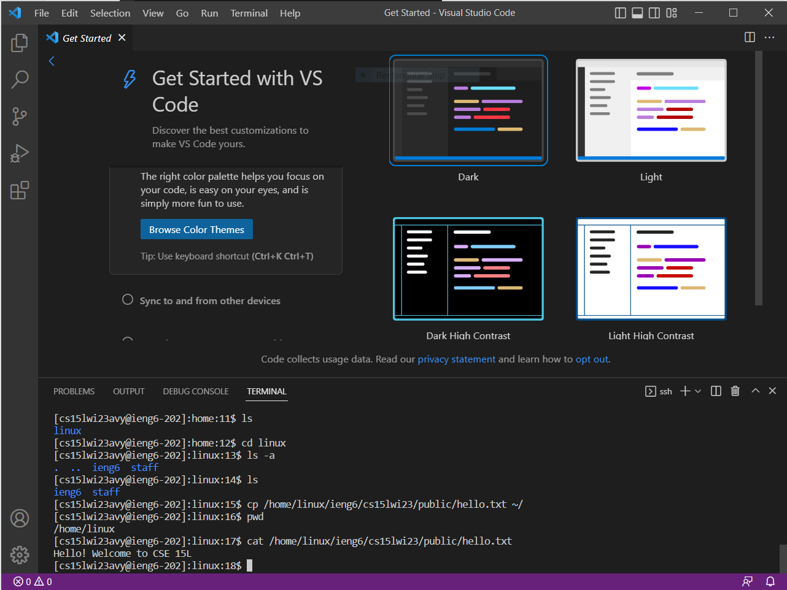
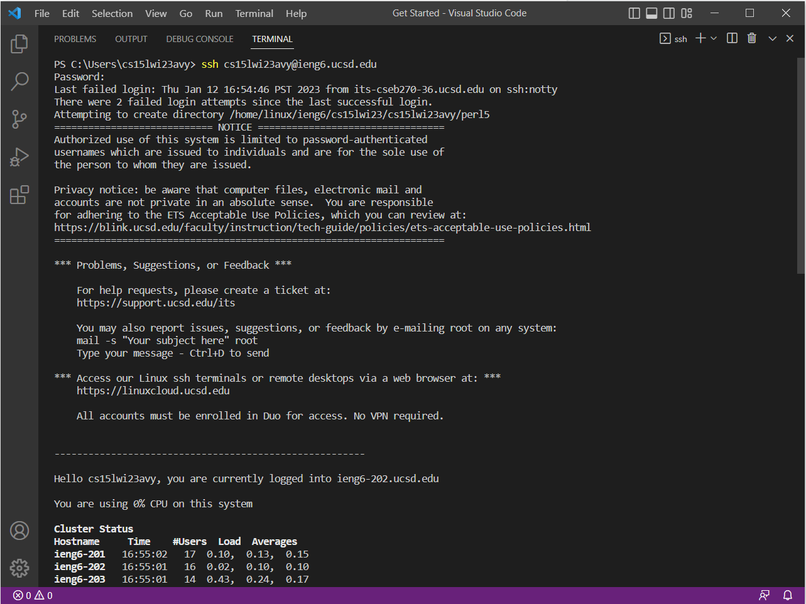
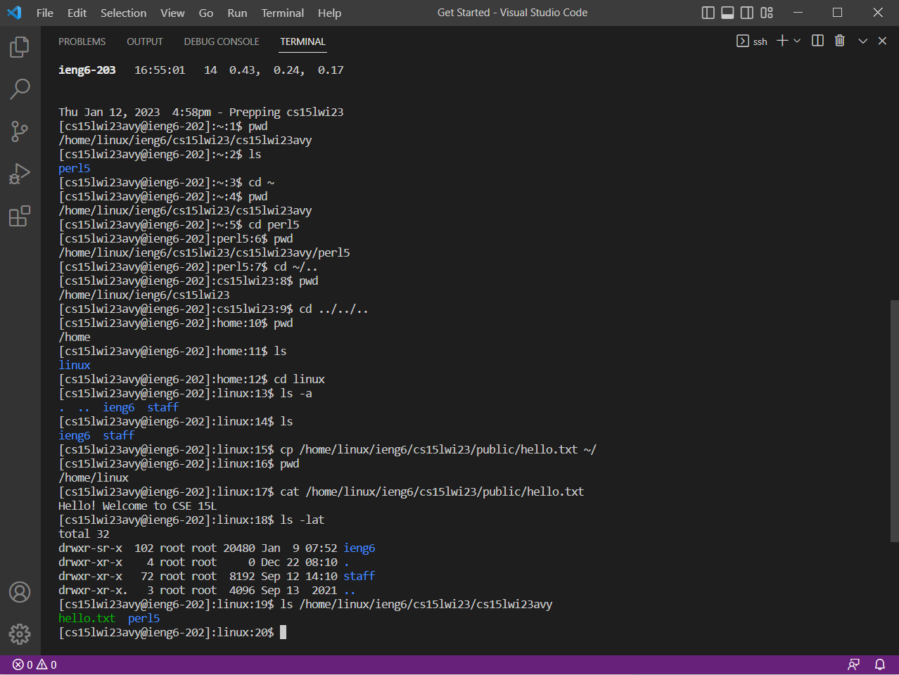

# Week 1 Lab Report
## Installing VSCode
1. Go to the [Visual Code Studio Website](https://code.visualstudio.com/download)
2. Download for your Operating System (Windows, in my case) and follow the instructions
3. You should have VSCode downloaded now!

## Remotely Connecting
1. Download Git for Windows from [here](https:///git-scm.com/download/win)
2. Open VSCode and a new terminal (ctrl + `)
3. Open the command palette (ctrl + shift + p)
4. Type - Select Default Profile
5. Select Git Bash from the options, and click the + icon in the terminal window
6. Use the following command, where XXX should be replaced by your personal cs15l username code:

   `ssh cs15lwi23XXX@ieng6.ucsd.edu`
8. If a confirmation message pops up when logging in for the first time, type in yes
9. Enter your password (There is no feedback when typing it in!)
10. You should be logged in now!

## Trying Some Commands
Try out some commands!

For Example: 
1. `cd <path>` allows you to navigate the directories of your system
2. `pwd` will allow you to figure out where you currently are
3. `cd ~` should take you directly to the home directory!
4. `ls <directory>` will allow you to find out the contents of a directory without needing to change to it!

Working with commands like these can help one in getting comfortable with the command line and navigating it.

For more examples of commands, try out the commands shown in the image and try to figure out what they do!

