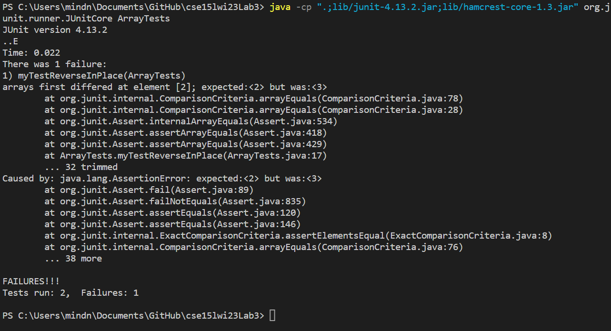

# Lab Report 2
## Part 1

### Code

#### StringServer.java:

```java
import java.io.IOException;
import java.net.URI;

class Handler implements URLHandler {
    // The one bit of state on the server: a number that will be manipulated by
    // various requests.
    String totalString = "";

    public String handleRequest(URI url) {
        System.out.println("Arohan's Path: " + url.getPath());
        if (url.getPath().contains("/add-message")) {
            String[] parameters = url.getQuery().split("=");
            if (parameters[0].equals("s")) {
                totalString += "\n" + String.format(parameters[1]);
                return String.format(totalString);
            }
        }
        return "404 Not Found!";
    }
}

class StringServer {
    public static void main(String[] args) throws IOException {
        if(args.length == 0){
            System.out.println("Missing port number! Try any number between 1024 to 49151");
            return;
        }

        int port = Integer.parseInt(args[0]);

        Server.start(port, new Handler());
    }
}
```

#### Server.java:

```java
// A simple web server using Java's built-in HttpServer

// Examples from https://dzone.com/articles/simple-http-server-in-java were useful references

import java.io.IOException;
import java.io.OutputStream;
import java.net.InetSocketAddress;
import java.net.URI;

import com.sun.net.httpserver.HttpExchange;
import com.sun.net.httpserver.HttpHandler;
import com.sun.net.httpserver.HttpServer;

interface URLHandler {
    String handleRequest(URI url);
}

class ServerHttpHandler implements HttpHandler {
    URLHandler handler;
    ServerHttpHandler(URLHandler handler) {
      this.handler = handler;
    }
    public void handle(final HttpExchange exchange) throws IOException {
        // form return body after being handled by program
        try {
            String ret = handler.handleRequest(exchange.getRequestURI());
            // form the return string and write it on the browser
            exchange.sendResponseHeaders(200, ret.getBytes().length);
            OutputStream os = exchange.getResponseBody();
            os.write(ret.getBytes());
            os.close();
        } catch(Exception e) {
            String response = e.toString();
            exchange.sendResponseHeaders(500, response.getBytes().length);
            OutputStream os = exchange.getResponseBody();
            os.write(response.getBytes());
            os.close();
        }
    }
}

public class Server {
    public static void start(int port, URLHandler handler) throws IOException {
        HttpServer server = HttpServer.create(new InetSocketAddress(port), 0);

        //create request entrypoint
        server.createContext("/", new ServerHttpHandler(handler));

        //start the server
        server.start();
        System.out.println("Server Started! Visit http://localhost:" + port + " to visit.");
    }
}
```

### Usage

#### Starting the Server

1. Before using the ability to add a message, I first started the server.
2. I used localhost to run the server with the following commands:
   ```
   javac Server.java StringServer.java
   java StringServer 4000
   ```
3. 4000 here is given as a String argument to array `args`
4. This String is then parsed and stored in `port` with type int
5. This is passed as an argument to the static `Server.start` method
6. The same port is passed as an argument to the static `HttpServer.create` method, and the resulting HttpServer is stored in server
7. The server is started


#### Adding Message 'Hold, Orwell'

1. The server is constantly looking for changes to its URL and calling `handleRequest`.
2. We send 'Hold, Orwell' into the URL as `\add-message?s=Hold,%20Orwell`.
3. This url is used as an argument when calling `handleRequest`.
4. The console reflects the request by printing the url to the server computer's console.
5. `url.getPath().contains()` is called to see if the URL path is in the correct format.
6. As the path is in the correct format, `url.getQuery().split("=")` splits our request and maps it to the `parameters` array.
7. The `parameters` array contains at it's 0th index `"s"` and at its 1st index `"Hold, Orwell"`.
8. A `.equals` call is made to make sure that the 0th index is, indeed, `s`.
9. As this is true, `"\n"` and `"Hold, Orwell"` are added to the String `totalString`, which previously contained `""`.
10. The entirety of `totalString` is returned and stored in `ret`, which is passed as a parameter to `os.write`.
11. The contents of `totalString` are written to the webpage.


#### Adding Message 'Charge Now!'

1. The server is constantly looking for changes to its URL and calling `handleRequest`.
2. We send 'Hold, Orwell' into the URL as `\add-message?s=Charge%20Now!`.
3. This url is used as an argument when calling `handleRequest`.
4. The console reflects the request by printing the url to the server computer's console.
5. `url.getPath().contains()` is called to see if the URL path is in the correct format.
6. As the path is in the correct format, `url.getQuery().split("=")` splits our request and maps it to the `parameters` array.
7. The `parameters` array contains at it's 0th index `"s"` and at its 1st index `"Charge Now!"`.
8. A `.equals` call is made to make sure that the 0th index is, indeed, `s`.
9. As this is true, `"\n"` and `"Charge Now!"` are added to the String `totalString`, which previously contained `"\nHold, Orwell"`.
10. The entirety of `totalString` is returned and stored in `ret`, which is passed as a parameter to `os.write`.
11. The contents of `totalString` are written to the webpage.


## Part 2

### Code

#### Failure-Inducing JUnit Test

```java
@Test 
public void testReverseInPlace() {
    int[] input1 = {1,2,3,4};
    ArrayExamples.reverseInPlace(input1);
    assertArrayEquals(new int[]{4,3,2,1}, input1);
}
```

#### Non-Failure-Inducing JUnit Test

```java
@Test 
public void testReverseInPlace() {
    int[] input1 = { 3 };
    ArrayExamples.reverseInPlace(input1);
    assertArrayEquals(new int[]{ 3 }, input1);
}
```

#### Symptoms



#### ArrayExamples.java (method: reverseInPlace) (BEFORE)

```java
static void reverseInPlace(int[] arr) {
    for(int i = 0; i < arr.length; i += 1) {
      arr[i] = arr[arr.length - i - 1];
    }
  }
```

#### ArrayExamples.java (method: reverseInPlace) (AFTER)

```java
static void reverseInPlace(int[] arr) {
    int tempData;
    for(int i = 0; i < (arr.length/2); i += 1) {
      tempData = arr[i];
      arr[i] = arr[arr.length - i - 1];
      arr[arr.length - i - 1] = tempData;
    }
}
```

When I tested reverseInPlace using the array {1,2,3,4}, the expected output was {4,3,2,1}. However, the actual output was {4,3,3,4}. The problem was that the array was replacing the final values using edited values of the array. To solve this, I created a temporary value holder and made the loop half as long. Using that temporary data holder, I changed both the front and back of the array at the same time. If there were an odd number of values in the array, the center value need not be changed.

## Part 3

I learned many different things from Labs 2 and 3! Some of them include:

1. Creating a web server using localhost
2. Using web server URLs as input to display output
3. How servers behave with multiple simultaneous users
4. How to create my very own (primtive) search engine
5. Using GitHub Desktop to work with code locally
6. Using JUnit to easily find and fix bugs (gained proficiency!)
