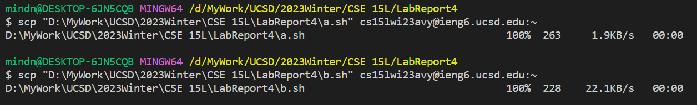
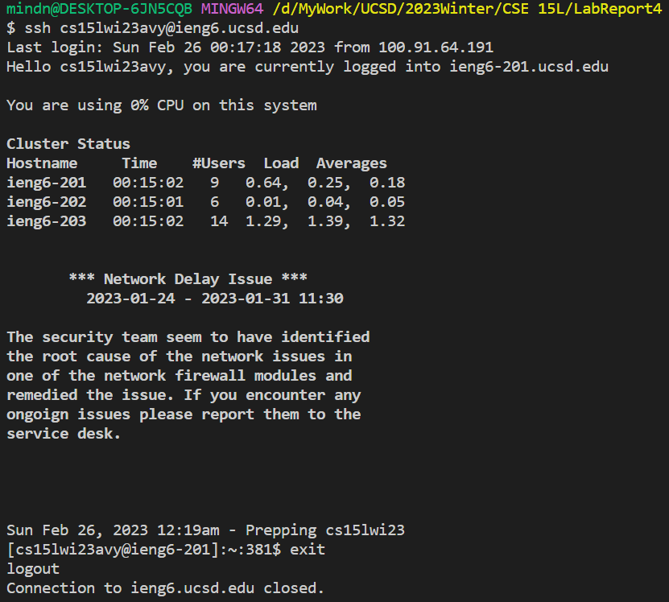
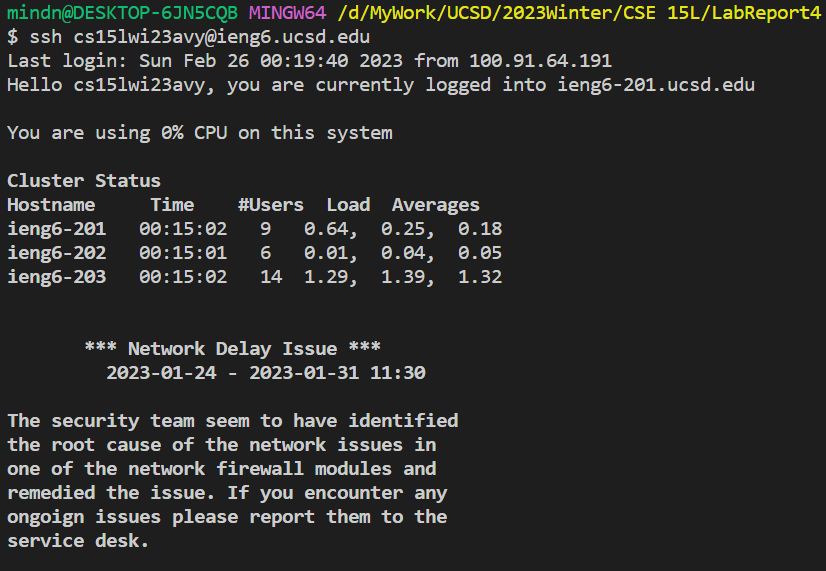
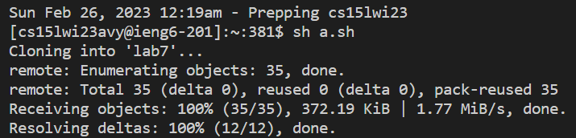
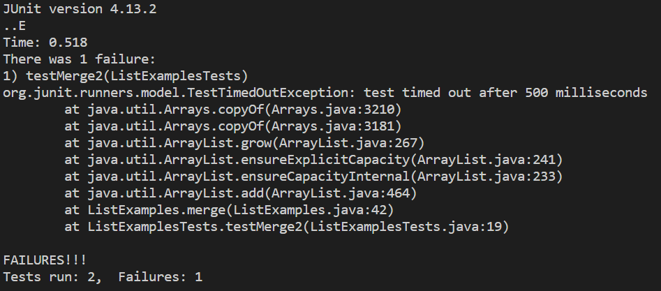
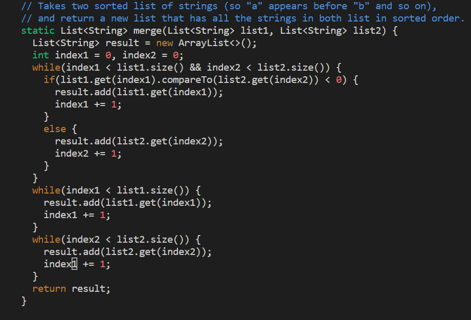
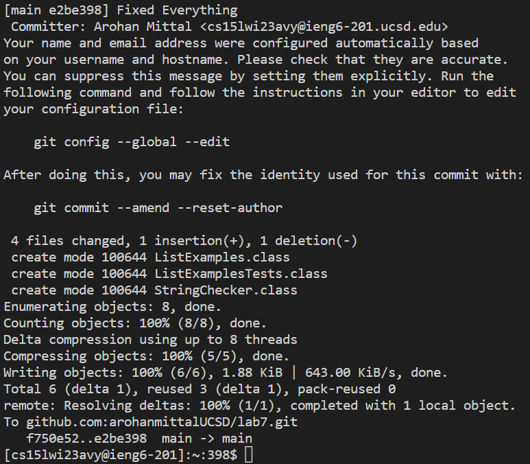

html {
    overflow-x: hidden; }
# Lab Report 4

## The Tasks

1. Setup Delete any existing forks of the repository you have on your account
2. Setup Fork the repository
3. The real deal Start the timer!
4. Log into ieng6
5. Clone your fork of the repository from your Github account
6. Run the tests, demonstrating that they fail
7. Edit the code file to fix the failing test
8. Run the tests, demonstrating that they now succeed
9. Commit and push the resulting change to your Github account (you can pick any commit message!)

## The Set Up

The final goal is, of course, speed via auto completion. The course website gives interesting ways to make humans more efficient through the use of keyboard shortcuts via autocompletion. I, however, propose to take this a step further into automation - or well, close to it anyways.

### Create a.sh

Create the a .sh file in a predetermined directory in our local computer in the following form.

#### a.sh

```
git clone git@github.com:arohanmittalUCSD/lab7.git
cd lab7
javac -cp .:lib/hamcrest-core-1.3.jar:lib/junit-4.13.2.jar *.java
java -cp .:lib/hamcrest-core-1.3.jar:lib/junit-4.13.2.jar org.junit.runner.JUnitCore ListExamplesTests
vim ListExamples.java
javac -cp .:lib/hamcrest-core-1.3.jar:lib/junit-4.13.2.jar *.java
java -cp .:lib/hamcrest-core-1.3.jar:lib/junit-4.13.2.jar org.junit.runner.JUnitCore ListExamplesTests
git add .
git commit -m "Fixed Everything"
git push
```

<br/>

The `clone` command clones the fork of our repository.

The `cd lab7` command changes our directory into the fork.

The next two commands with `javac` and `java` run the tests, to show that they fail.

The `vim` command opens up the vim editor so that we can edit the `ListExamples.java` files to debug it

The next two commands with `javac` and `java` run the tests again, to show that they succeed now

The last 3 commands are used to add, commit, and push the files that we have changed to our github account's fork with the commit message "Fixed Everything", because we have, in fact, fixed everything.

### Setting up the ieng6 machine

1. Use the command `scp <path to a.sh> cs15lwi23___@ieng6.ucsd.edu:~` to copy a.sh to your ieng6 machine.



2. Log into your ieng6 machine with the command `ssh cs15lwi23___@ieng6.ucsd.edu`
3. Immediately exit with `exit`. We did this so that we can access this command very quickly with just a press of the <up> button. This increases our speed as we do not need to type the the full command `ssh cs15lwi23___@ieng6.ucsd.edu` in our actual attempt to complete the tasks at speed.



## Action

Assuming our computer, ieng6 machine, and github are set up as described in week 7 of the course website, we can now proceed to performing the tasks.

Keys Pressed: \<up\>\<enter\>
  
This takes us to the previous command, which logs us into our ieng6 machine



Keys Pressed: sh a.sh

This completes tasks 5 and 6, and opens up the editor for task 7.





Keys Pressed: \<down\>\*(42)\<right\>\*(12)a\<backspace\>1\<escape\>:w\<enter\>:qa\<enter\>

The crux of this is to navigate to line 43 and change `index1` to `index2`, and then to save and exit the vim editor. The 'a.sh' script will then continue and complete the remaining tasks automatically, thereby making the completeion of our tasks *fast*.





